# recipes-website

## Introduction and tecnologies

> In this website you will be able to search for recipes using multiple filters and you can also create your own recipes! This webSite was made entirely by Lucila Rossi as an assigment at soyHenry's bootcamp.
> The frontEnd was made with React-Redux.
> The styles were made with pure css as an opportunity to practice this skills.
> The backEnd was made in Node.js with Express.
> This website gets information from an external API and combines this data with a postgress database.

## Check out the video!
> <a href="https://vimeo.com/572383679" target="blank"> Click here!</a>

## Installation

1. Install all dependencies inside api folder
2. Install all dependencies inside client folder
3. Create a postgres database
4. Go to https://spoonacular.com/ and create an account in oder to get your apiKey
5. Once you have gotten your apiKey create a .env file in your api folder
6. Add the following variables: 

DB_USER=**your postgress user name**

DB_PASSWORD=**your postgress password**

DB_HOST=**localhost**

DB_NAME=**the name you gave to the database created in step 3**

PORT=**the port number of your preference**

API_KEY_NUMBER=**apiKey nummber that you got on step 4**

7. run "npm run dev" api folder
8. Run "npm start" inside client folder and enjoy the web!

## Some previews!

1. Landing page
> Full-Screen version:

  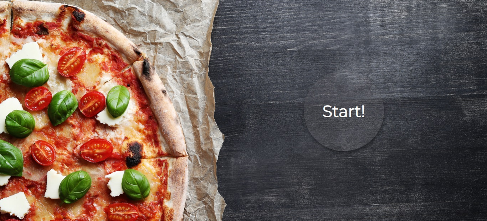

> Mobile version:

  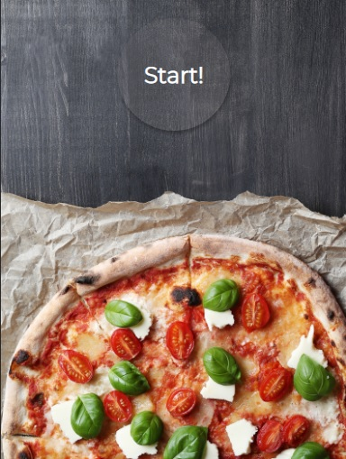

2. Home page
> Full-Screen version:

  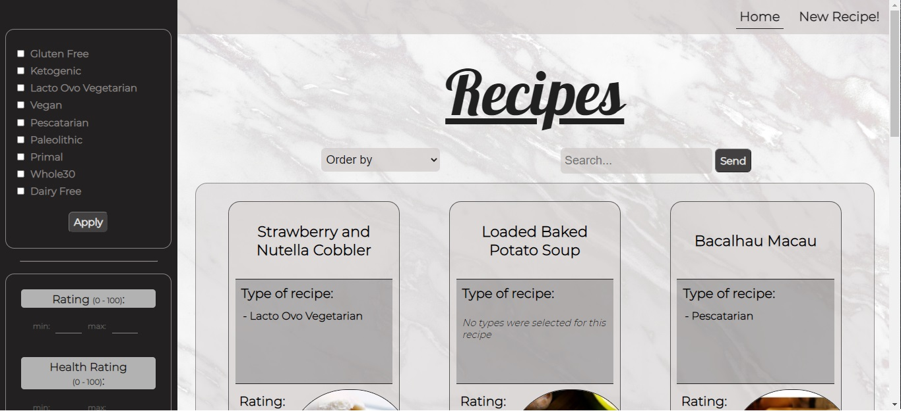

> Mobile version:

  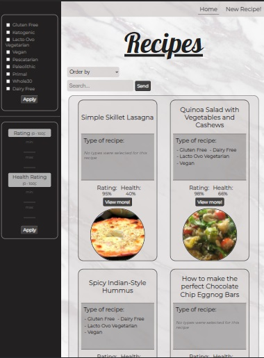

3. Card detail

> Full-Screen version / Mobile version:

  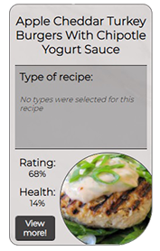
  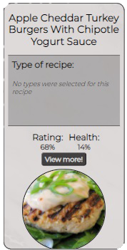

4. Filters and OrderBy components

 
  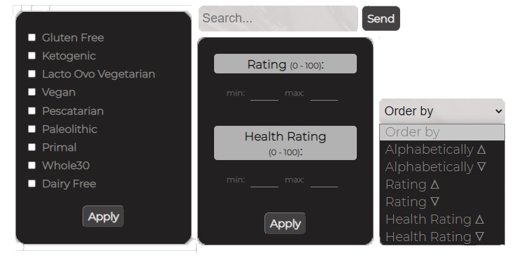

 

5. Recipe Detail
> Full-Screen version:

  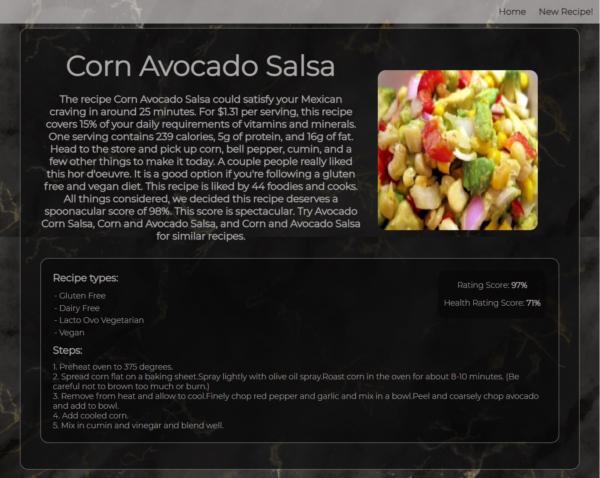

> Mobile version:

  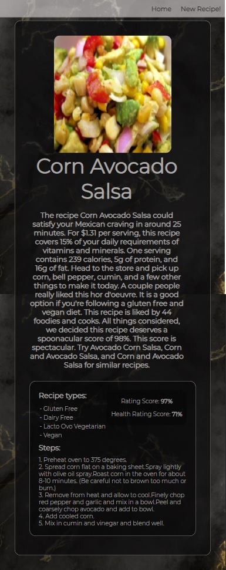

5. Creating a recipe
> Full-Screen version:

  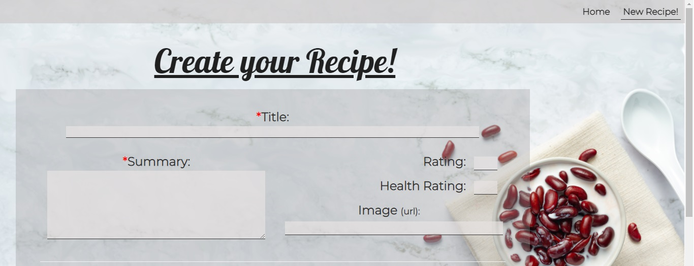

  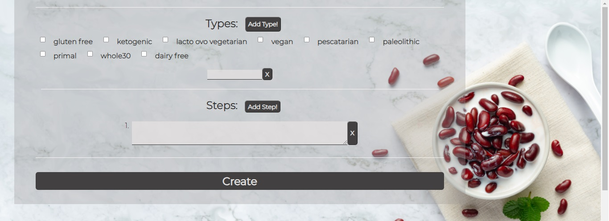

> Mobile version:

  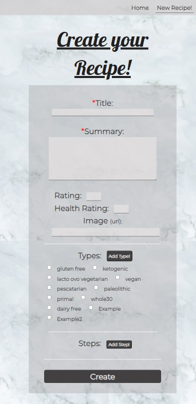

## Contact me!

📫 How to reach me 
- **lucilamrossi@gmail.com**
- LinkedIn: <a href="https://linkedin.com/in/lucila-rossi" target="blank">/lucila-rossi </a>
- GitHub: <a href="https://github.com/Lucilamrossi" target="blank">/Lucilamrossi </a>

